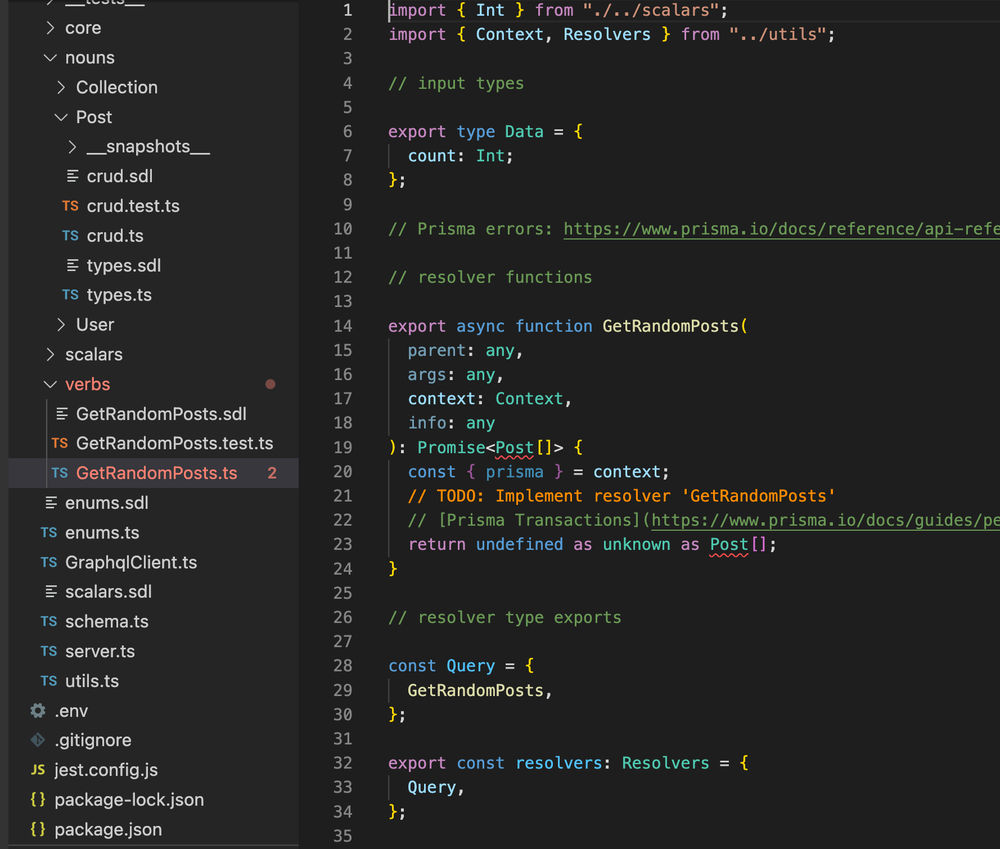

# Tutorial

We will use `Noun & Verb` to build `GraphQL API Server` for `instagram-like`
photo management app!.

## Setup

?> If you are new to `Prisma`,
[Start from scratch](https://www.prisma.io/docs/getting-started/setup-prisma/start-from-scratch)
or
[Add to existing project](https://www.prisma.io/docs/getting-started/setup-prisma/add-to-existing-project)
might be helpful.

- Initialize project with `npm init -y && npx prisma init`.
- Add datasource (`Postgres`)
- Add generator (`Noun & Verb`)

We use `Supabase` here to get free `PostgreSQL` database.

Make new project, copy connection string from
`Setting - Database - Connection string - Nodejs`, and past it to
`schema.prisma` or `.env`. Make sure you replace `[YOUR-PASSWORD]` of connection
string.

## Design Schema

We need 3 model. `User`, `Collection`, and `Post`.

```prisma
model User {
  id String @id @default(cuid())
}

model Collection {
  id String @id @default(cuid())
}

model Post {
  id String @id @default(cuid())
}
```

Next, let's think about relations.

`User - Collection` is `1 - n`, and `Collection - Post` is `n - m`.

```prisma
model User {
  id          String       @id @default(cuid())
  collections Collection[]
}

model Collection {
  id     String  @id @default(cuid())
  User   User?   @relation(fields: [userId], references: [id])
  userId String?
  posts  Post[]
}

model Post {
  id          String       @id @default(cuid())
  collections Collection[]
}
```

Now let's add more fields to models.

- `User`
  - Name
    ([`@unique`](https://www.prisma.io/docs/reference/api-reference/prisma-schema-reference#unique))
- `Collection`
  - Name
- `Post`
  - Title
  - Description (Optional)
  - Images (List)

We also need `createdAt` and `updatedAt` for each model.

```prisma
model User {
  id          String       @id @default(cuid())
  createdAt   DateTime     @default(now())
  updatedAt   DateTime     @updatedAt
  name        String       @unique
  collections Collection[]
}

model Collection {
  id        String   @id @default(cuid())
  createdAt DateTime @default(now())
  updatedAt DateTime @updatedAt
  name      String
  User      User?    @relation(fields: [userId], references: [id])
  userId    String?
  posts     Post[]
}

model Post {
  id          String       @id @default(cuid())
  createdAt   DateTime     @default(now())
  updatedAt   DateTime     @updatedAt
  title       String
  description String?
  images      String[]
  collections Collection[]
}
```

## Add Annotations

You can learn about annotations in our [guide](guides/annotations.md).

```prisma
/// @seed
model User {
  /// @readOnly
  id          String       @id @default(cuid())
  /// @readOnly
  /// @mock faker.date.past
  createdAt   DateTime     @default(now())
  /// @readOnly
  /// @mock faker.date.recent
  updatedAt   DateTime     @updatedAt
  /// @mock mocker.userName
  name        String       @unique
  collections Collection[]
}

model Collection {
  /// @readOnly
  id        String   @id @default(cuid())
  /// @readOnly
  /// @mock faker.date.past
  createdAt DateTime @default(now())
  /// @readOnly
  /// @mock faker.date.recent
  updatedAt DateTime @updatedAt
  /// @mock faker.word.noun
  name      String
  /// @mock faker.lorem.paragraph
  description String?
  User      User?    @relation(fields: [userId], references: [id])
  userId    String?
  posts     Post[]
}

model Post {
  /// @readOnly
  id          String       @id @default(cuid())
  /// @readOnly
  /// @mock faker.date.past
  createdAt   DateTime     @default(now())
  /// @readOnly
  /// @mock faker.date.recent
  updatedAt   DateTime     @updatedAt
  /// @mock faker.word.noun
  title       String
  /// @mock faker.lorem.paragraph
  description String?
  /// @mock faker.unsplash travel
  images      String[]
  collections Collection[]
}
```

Few things to point out :

1. `@readOnly` is used for `id`, `createdAt`, and `updatedAt`.

   These fields are managed by `Prisma`. Our `API` should only read the value.

   - [Attribute functions](https://www.prisma.io/docs/reference/api-reference/prisma-schema-reference#attribute-functions)
   - [@updatedAt](https://www.prisma.io/docs/reference/api-reference/prisma-schema-reference#updatedat)

2. `@mock mocker.userName` is used for name field in `User`.

   Maybe `@mock faker.name.firstName` is suffice. **But we have `@unique`
   constraint here.** Although we are going to generate small number of users,
   it is stil possible that duplicated name causes problem.

   So we will write `custom mocker` to prevent this.

3. `Post - images` field might not
   [properly seeded as expected.](guides/integration?id=seeding)

## Run Generator

```
npx prisma generate
```

This takes some time at first to install dependencies. but it is **much faster
after the first run.**

If everything goes well,
`✔ Generated Noun & Verb - GraphQL generator for Prisma` will be printed.

---

Now, run `npm run todo` to check if we have something to do before doing
anything.


It will run `leasot` to find all `TODO` that `Noun & Verb` generated.

Since we use custom mocker for `User - name`, we need to implement it.

## Implement Custom Mocker

In `src/__tests__/fixtures/seeder/mockers/User/userName.ts`, you'll find this :

```typescript
import { Faker } from "@faker-js/faker";
import { Independent } from "../../UserGenerator";

export default function (faker: Faker, fields?: Independent, args?: string) {
  // TODO: implement mock data generator for 'User.name'
}
```

`fields?: Independent` is quite interesting. But it's not required here.

For now, all we need to do is to make sure the name we generate is
[unique](https://fakerjs.dev/api/unique.html).

```typescript
export default function (faker: Faker) {
  return faker.unique(faker.name.firstName);
}
```

You can learn more about `custom mocker` in our
[guide](guides/custom-mocker.md).

## Seed Database

!> Request timed out can happen while seeding database. You can read about it in
[troubleshooting](guides/troubleshooting?id=request-timed-out).

You can run seeder scripts generated by `Noun & Verb` using `db seed` command.
It takes few minutes.

```
UNSPLASH_ACCESS_KEY=[SECRET] npx prisma db seed
```

`UNSPLASH_ACCESS_KEY` is needed because we added `faker.unsplash` before. If you
don't provide it, error message will give you enough information to get one.

Since we are using `Supabase`, we can easily check if database is properly
seeded in `Table Editor`.


But you can also do the same with
[`Prisma Studio`](https://www.prisma.io/studio) even if you are not using
`Supabase`.

```
npx prisma studio
```


?> Note that database seeding is also happeneds with `npx prisma migrate dev`
and `npx prisma migrate reset`. You can learn about it in
[Integrated seeding with Prisma Migrate](https://www.prisma.io/docs/guides/database/seed-database#integrated-seeding-with-prisma-migrate)

## Test & Play

You can run `npm run dev` to open `GraphQL Playground`. You can also run `NODE_ENV=dev npm run test` to run integration test which gives 100% coverage.

## Implement Custom Verb

Since there's no hidden, or `Noun & Verb` specific code in the generated output, you can do whatever you want to do.

The most common thing you might want to do is adding new operation(Custom verb). So we generated most of the boilerplate code for you. Let's see how it works by adding `getRandomPost` query!

```graphql
extend type Query {
  GetRandomPost: Post,
}
```



```typescript
export async function GetRandomPost(
  parent: any,
  args: any,
  context: Context,
  info: any
): Promise<Post | null> {
  const { prisma } = context;

  const total =  await prisma.post.count();

  const ret = await prisma.post.findFirst({
    skip: Math.floor(Math.random() * total)
  })

  return ret;
}
```


