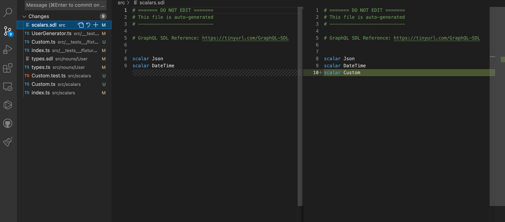
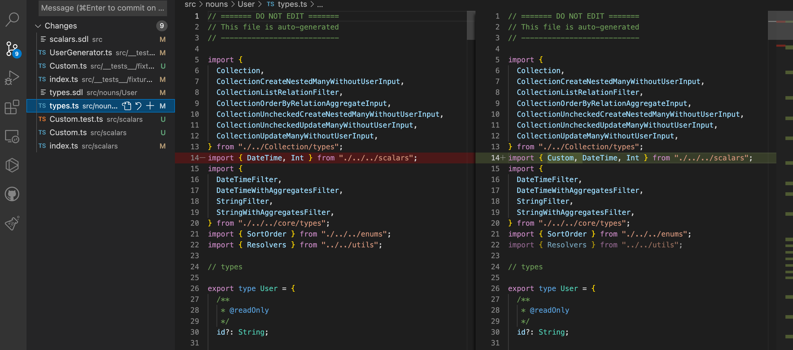
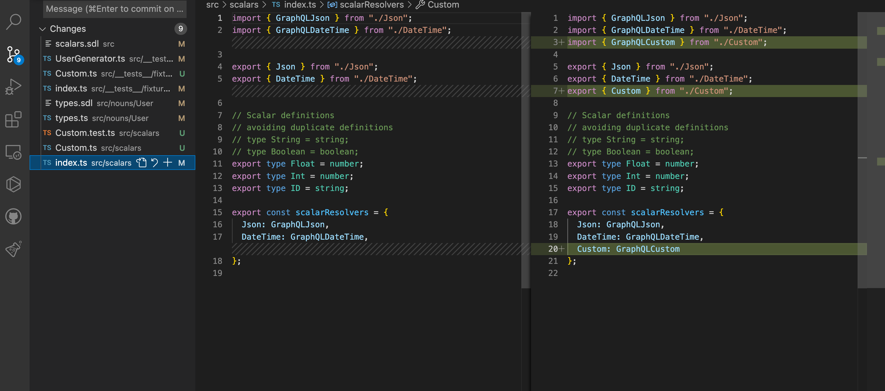
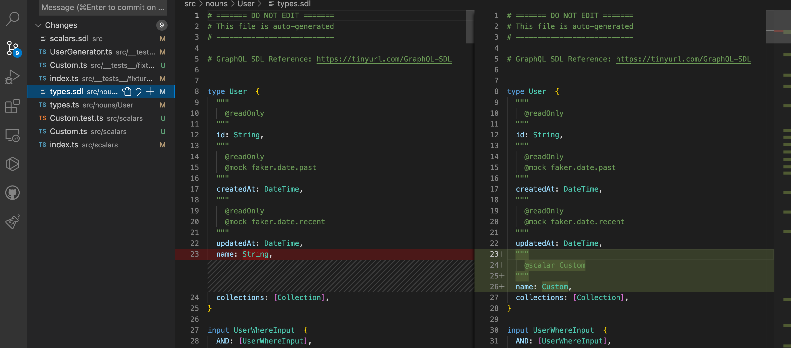
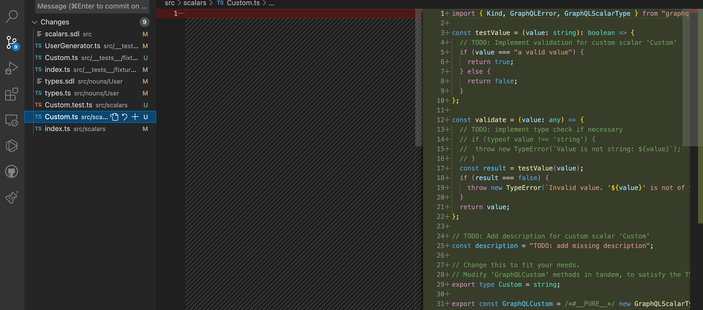
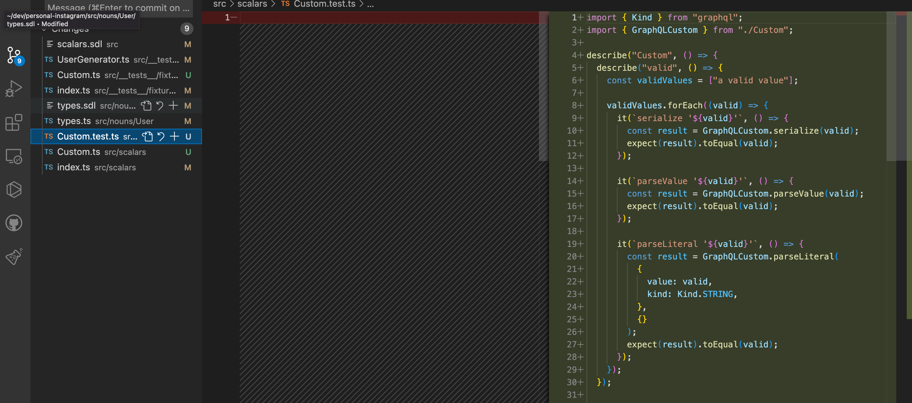
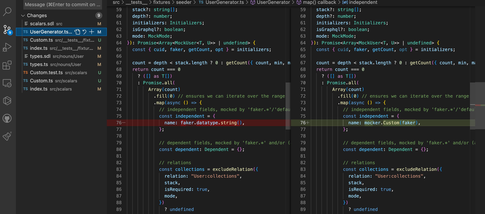
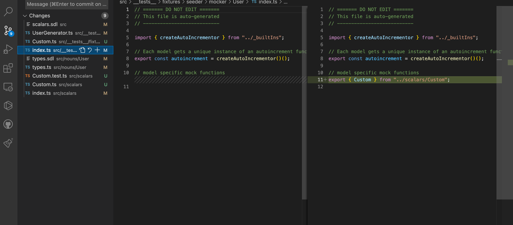

# Annotations

!> To add `Noun & Verb`'s annotations to `Prisma schema`, you should use
[`///` instead of `//`](https://www.prisma.io/docs/concepts/components/prisma-schema#comments)

`Noun & Verb` works by adding 8 annotations to
[`Prisma schema`](https://www.prisma.io/docs/concepts/components/prisma-schema).

There's 4 possible position for annotations. `Enum`, `Enum value`, `Model` and
`Field`.

```prisma
// Enum
enum Type {
    // Enum value
    Buyer
    // Enum value
    Seller
}

// Model
model User {
    // Field
    id        String   @id @default(cuid())
    // Field
    type      Type
```

## @readOnly

?> **Position: Field / No arguments**

This field does not appear in the `Create` and `Update` input type definitions
in the `GraphQL schema`.

This annotation is useful to mark server generated fields such as `createdAt`
and `updatedAt`.

```prisma
/// @readOnly
createdAt DateTime @default(now())
```

## @createOnly

?> **Position: Field / No arguments**

This field only shows up in the `Create` input type definitions in the
`GraphQL schema`.

This annotation is useful to mark fields that are creational in nature, such as
`id`.

```prisma
/// @createOnly
id        String   @id @default(cuid())
```

## @writeOnly

?> **Position: Field / No arguments**

This field only shows up in the `Create` and `Update` input type definitions in
the `GraphQL schema`.

This annotation is useful to mark fields such as `password`.

```prisma
/// @writeOnly
password  String
```

## @mock

?> **Position: Field / 1 required argument**

See [List of supported faker properties](data/supported-faker.md) to check all
possible arguments. You can also create
[custom mocker](guides/custom-mocker.md).

```prisma
/// @mock faker.name.firstname
firstName String
```

`faker.name.firstname` will generate possible name such as `Allene`.

```prisma
// No @mock
firstName String
```

But this will use `faker.datatype.string` to generate random string such as
`vR)[L>ON>`.

Check out [mock function determination](data/mock-function-determination) for
details.

## @seed

?> **Position: Model / 1 optional argument**

!> If you are confused where to add `@seed`, read our [guide](guides/seeding).

A depth first, cycle avoiding walk is performed from each `@seed` node to seed
the database.

It assumes that root level models have **100 items** per table and relationships
have **between 0/1-20 elements**. But this can be overidden by argument.

```prisma
/// @seed {count: 100, min: 1, max: 20}
model User {
```

## @scalar

?> **Position: Field / 1 required argument**

Designates a format for the field, per `GraphQL` specifications. Defines the
`serialization / deserialization / validation` criteria for the field values.

`Noun & Verb` supports [76 scalar types](data/supported-scalars.md)
out-of-the-box. Using any of these values for the scalar, will generate an
appropriate scalar file properly wired up to use
[validator.js](https://www.npmjs.com/package/validator) for validating value.

```prisma
/// @scalar Email
email     String
```

Note that in example above, `faker.internet.email` will be used instead of
`faker.datetype.string` when creating mock data. This is because we have
**[default scalar-faker-mappings](data/mock-function-determination?id=scalar-faker-mappings)**,
which can be overridden by `@mock`.

---

If you can't find one you need in
[list of supported scalars](data/supported-scalars.md), you can create your own
`Custom Scalar`.

All you need to do is add annotation like below, and run `npx prisma generate`.

```diff
model User {
+ /// @scalar Custom
  name        String       @unique
}
```

Then, `Noun & Verb` will generate `Definition`, `Implementation Boilerplate`,
and `Mocker Boilerplate` for you.

<!-- tabs:start -->

#### **Scalar Definition**






#### **Scalar Implementation**




#### **Scalar Mock Function**





<!-- tabs:end -->

## @directive

?> **Position: Field, Enum / User define arguments**

!> Working in process. Do not use.

## @default

?> **Position: Field / No arguments**

!> Working in process. Do not use.
