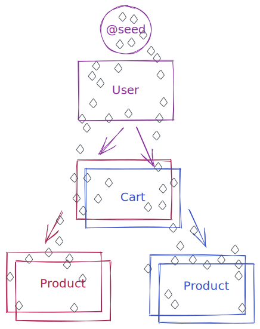
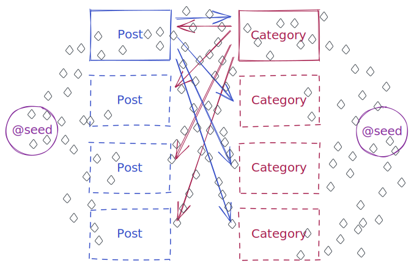

# Seeding

```shell
npx prisma studio
```

```prisma
model User {
  id        String   @id @default(cuid())
  cart      Cart?
}

model Cart {
  id        String    @id @default(cuid())
  user      User      @relation(fields: [userId], references: [id])
  userId    String    @unique
  items     Product[]
}

model Product {
  id        String   @id @default(cuid())
  carts     Cart[]
}
```



```prisma
model Post {
  id         Int        @id @default(autoincrement())
  categories Category[]
}

model Category {
  id    Int    @id @default(autoincrement())
  posts Post[]
}
```


