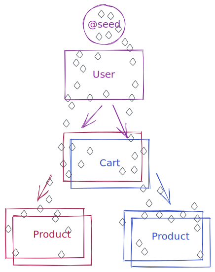
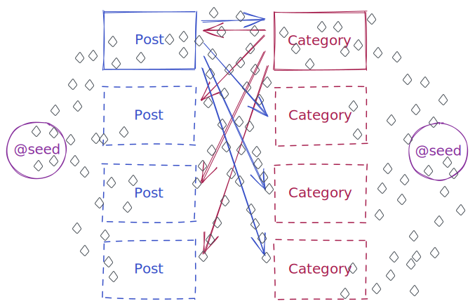

# Seeding

!> You should add [@seed](guides/annotations?id=seed) to schema before running
`npx prisma generate`.

A depth first, cycle avoiding walk is performed of from each `@seed` node.

Since relational databases cannot be guaranteed to be directed-acyclic-graphs,
we use the `@seed` annotation on models, to define which models to use as roots
of the seeding tree for mock data. A depth first, cycle avoiding walk is
performed of from each seed node. Field level `@mock` annotations are used to
generate the actual mock data.

The `@seed` implementation means that for many-to-many relations, mock data is
generated as one-to-many. One should provide `@seed` annotations to trigger mock
data generation in both directions.

`@seed` typically assumes that root level models have 100 items per table and
relationships have between 0/1-20 elements. This is done to create sufficient
data to trigger pagination examples in API usage, without overwhelming the mock
database. This is however controllable. `@seed` is the only annotations that
takes a JSON5 string as an argument to enable this.

```prisma
/// @seed
model User {
  id        String   @id @default(cuid())
  cart      Cart?
}

model Cart {
  id        String    @id @default(cuid())
  user      User      @relation(fields: [userId], references: [id])
  userId    String    @unique
  items     Product[]
}

model Product {
  id        String   @id @default(cuid())
  carts     Cart[]
}
```



```prisma
/// @seed
model Post {
  id         Int        @id @default(autoincrement())
  categories Category[]
}

/// @seed
model Category {
  id    Int    @id @default(autoincrement())
  posts Post[]
}
```



```shell
npx prisma studio
```
